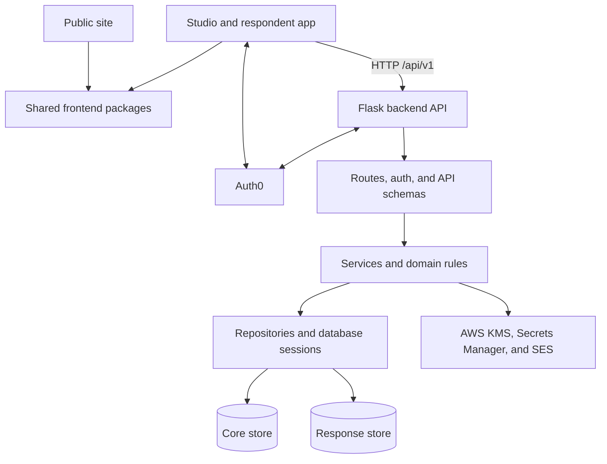

# Component map

Maps the major logical components inside the FlowForm system boundary and the dependencies between them. It intentionally stops before file-by-file ownership, request sequences, and host topology; those belong in the linked implementation, data-flow, and runtime documents.

## Logical components

| Component | Responsibility | Important dependencies |
| --- | --- | --- |
| Public site | Builds the static public product and documentation experience and embeds a browser-only builder demonstration. | Shared builder, schema, site-shell, style, and UI packages. |
| Studio application | Provides protected project and survey management plus the current token-based respondent route. Calls the backend through generated API contracts. | Auth0, backend API, shared frontend packages. |
| Shared frontend packages | Supply survey editing and filling, generated survey schemas, reusable UI, styles, and navigation configuration to both frontend applications. | Backend OpenAPI document for generated schema and permission outputs. |
| Backend API | Owns HTTP boundaries for account, Studio, respondent, and system operations and coordinates authentication, domain policy, persistence, encryption, and email. | Auth0, AWS clients, core store, response store. |
| Core data store | Owns identifying and administrative application state, survey content and access state, and submission metadata plus the source identifiers used to derive locators. | Backend only. |
| Response data store | Owns encrypted response envelopes and encrypted current-answer rows. It has no SQL relationship to the core store. | Backend only. |

## Component relationships

The arrows show dependency and communication direction, not a guarantee that every module follows one mechanically enforced layering rule. Detailed code entry points belong in [[backend|Backend implementation]] and [[frontend|Frontend implementation]].

## Backend coordination boundary

Flask routes handle HTTP parsing, authentication decorators, and response serialization. Services and domain modules apply use-case and policy rules; repositories and the database manager provide persistence access. Public-submission services are the main cross-store coordinator: they write core submission state and separately persist encrypted payloads in the response store.

Because the stores use independent SQLAlchemy sessions, there is no transaction spanning both databases. Compensating cleanup and reconciliation exist for some partial failures, but complete sequence and recovery analysis belongs in [[data-flows|Data flows]] and [[responses-and-encryption|Responses and encryption]].

## Frontend sharing boundary

The two frontend applications are separate builds in one pnpm workspace. They import source from the shared packages rather than communicating with those packages as runtime services. Studio alone currently contains backend API clients and Auth0 setup; the public site's current pages do not call the backend.

Generated frontend API and builder artifacts derive from `backend/openapi.yaml`. This keeps a contract-generation relationship between backend and frontend without making generated files independent sources of truth. Regeneration ownership belongs in [[generated-files|Generated files]].

## Runtime realization boundary

Local development Compose runs the backend with two PostgreSQL containers while the frontend applications run as separate development processes. The shared runtime Compose files declare a backend container on an app host and Caddy/Squid on a proxy host. AWS CDK declares static frontend hosting and parts of the proxy/app host shape, but the database stack and bootstrap integration are not complete. See [[runtime-containers|Runtime containers]] and [[deployment-model|Deployment model]] before treating any one realization as the current production topology.

## Open questions

- Which logical components are currently deployed in production, and on which checked-in runtime realization?
- Will public-slug response collection gain a frontend route, and which application will own it?
- Are the existing cross-database recovery paths sufficient for every partial-commit case?

## Related documents

- [[system-context|System context]]
- [[runtime-containers|Runtime containers]]
- [[data-flows|Data flows]]
- [[backend|Backend implementation]]
- [[frontend|Frontend implementation]]
- [[security-model|Security model]]
- [[responses-and-encryption|Responses and encryption]]
