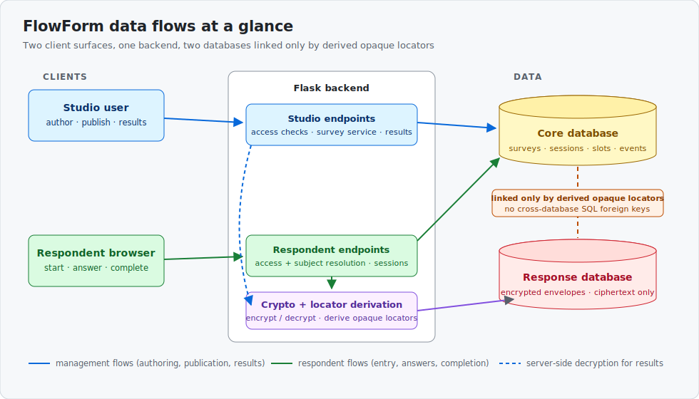
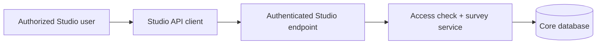
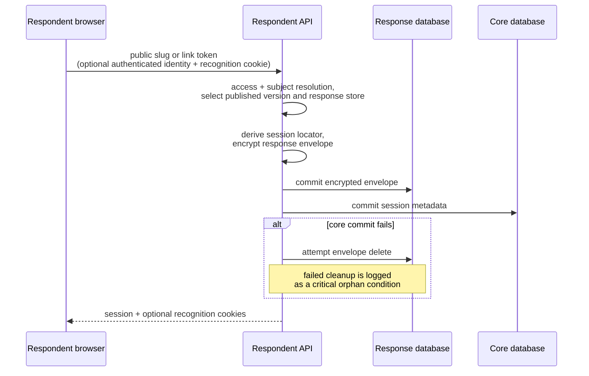
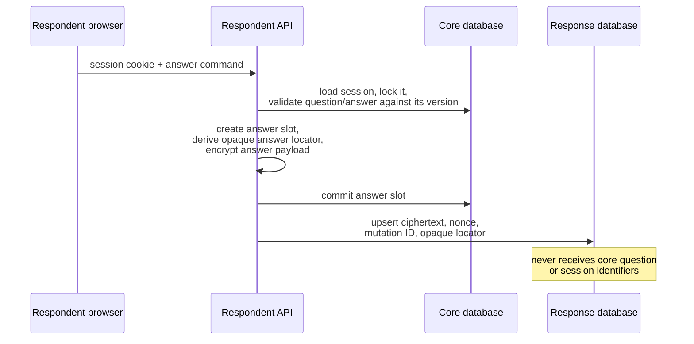
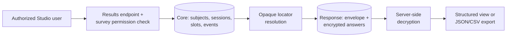
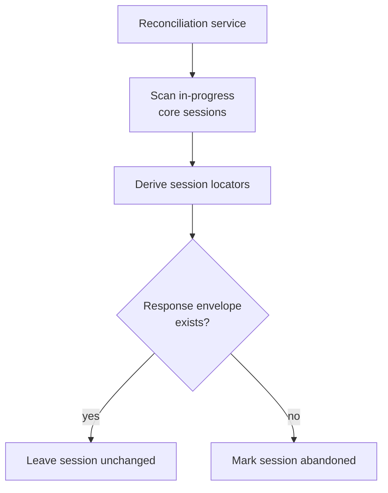

# Data flows

Documents major information flows that cross components and trust boundaries.

## Scope

This page shows the direction and ownership of important runtime information. It
does not specify every endpoint, field, permission, crypto primitive, or failure;
those details belong in the linked domain, workflow, implementation, and
reference pages.

## The five flows at a glance

| # | Flow | Started by | Core database | Response database |
|---|------|-----------|---------------|-------------------|
| 1 | [Survey authoring and publication](#survey-authoring-and-publication) | Studio user | writes drafts, versions, compiled rules | — |
| 2 | [Respondent entry and session start](#respondent-entry-and-session-start) | Respondent browser | writes session metadata | writes encrypted envelope |
| 3 | [Answer save, events, and completion](#answer-save-events-and-completion) | Respondent browser | writes answer slots and events | upserts ciphertext |
| 4 | [Results read and export](#results-read-and-export) | Studio user | reads metadata | reads ciphertext (decrypted server-side) |
| 5 | [Recovery flow](#recovery-flow) | Reconciliation service | marks orphaned sessions `abandoned` | checks envelope presence |

The two databases are never joined in SQL. Every cross-database association goes
through a derived opaque locator, so the response side holds ciphertext without
core identifiers, and the core side holds identifiers without answer content.

## Survey authoring and publication

Draft questions and scoring rules are stored against a survey version. Publishing
checks that the version is a non-empty draft, compiles its nodes and scoring
rules, ensures response-storage and survey-encryption-key prerequisites, and
marks it as the survey's active published version. Respondent collection then
binds to that version. [[Surveys and versioning]] owns the lifecycle and
[[Projects and access]] owns authorization semantics.

## Respondent entry and session start

The access resolver selects a published survey version and response store. The
subject flow may associate the attempt with a project subject, depending on the
access method, authenticated actor, assigned participant, and recognition state.
The service creates core session metadata and a response-side envelope linked by
an opaque derived locator. [[Links and subjects]] owns identity resolution;
[[Submissions]] owns the attempt lifecycle.

> [!WARNING]
> Session start crosses two independent database transactions. The response
> envelope is committed before the core transaction; if the core commit fails,
> the service attempts to delete the envelope. Failed cleanup is logged as a
> critical orphan condition. This is compensation, not an atomic cross-database
> commit.

## Answer save, events, and completion

The response database receives the current ciphertext, nonce, mutation ID, and
opaque locator, not the core question or session identifiers. Question-viewed
and answer-saved analytics remain core-side events. Completion locks the core
session, moves it from `in_progress` to `completed`, records a best-effort event,
and evicts the cached write context. Detailed payload and encryption contracts
belong in [[Responses and encryption]].

> [!WARNING]
> Answer save also uses sequential core and response commits. A committed core
> slot can therefore exist without a response answer if the later response write
> fails; the results read path can report that the encrypted answer is absent.

## Results read and export

Management reads begin from core metadata and retrieve response-side data only
when requested and available. Decryption occurs in the backend; the response
database does not gain core identifiers through this read path. Authorization,
redaction, and export contracts require deeper review in [[Security model]],
[[Responses and encryption]], and [[Backend implementation]].

## Recovery flow

The reconciliation service scans in-progress core sessions, derives their
session locators, and checks for response envelopes. A session whose envelope is
missing is marked `abandoned`; matched sessions are left unchanged.

> [!NOTE]
> The inspected code defines this operation, but this pass did not find evidence
> that a deployed scheduler or operator workflow invokes it.

## Knowledge boundaries

- The page describes application flow from static source; it does not establish
  production traffic, health, scale, or deployed topology.
- Cross-database compensation and reconciliation do not cover every possible
  partial failure. Operational ownership and retry policy remain unresolved.
- Cache, KMS, and secret-loading mechanics are intentionally left to
  [[Security model]], [[Configuration implementation]], and
  [[Secrets and configuration]].

## Related documents

- [[Component map]]
- [[Trust boundaries]]
- [[Surveys and versioning]]
- [[Links and subjects]]
- [[Submissions]]
- [[Responses and encryption]]
