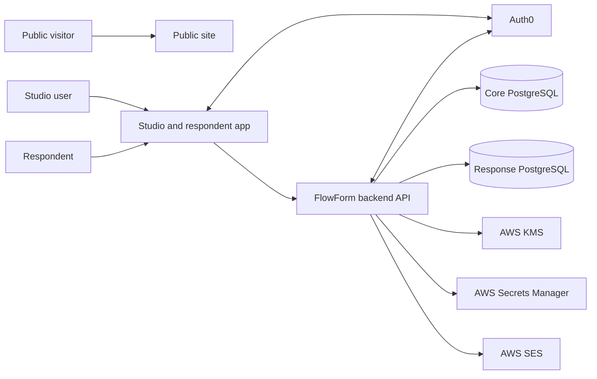

# System context

Places FlowForm in relation to its users, externally operated services, and persistent stores. Internal component responsibilities belong in [[Component map]]; host, network, and environment topology belong in [[Deployment model]] and [[Trust boundaries]].

## People and entry points

| Actor | Current interaction with FlowForm |
| --- | --- |
| Public visitor | Uses the Astro public site for product and documentation content and an in-browser survey-builder demonstration. The current public-site source does not call the backend API. |
| Authorized Studio user | Signs in through Auth0, then uses the Studio application and authenticated API operations to manage projects, surveys, access, participants, and results. |
| Respondent | Uses the respondent experience currently bundled with Studio. Public-slug and general-link access may be anonymous; authenticated links require an Auth0-backed account that satisfies the assigned participant checks. |

The product concepts behind these interactions are owned by [[Identity and authentication]], [[Links and subjects]], and [[Submissions]].

## System boundary

This is a logical context, not a deployed-network diagram. It omits reverse proxies, static hosting, image registries, DNS, and CI because their realized shape varies by environment and remains partly unfinished in the checked-in infrastructure.

## External systems and stores

| Dependency | Verified role |
| --- | --- |
| Auth0 | Hosts interactive authentication for Studio and authenticated respondents. The backend verifies bearer tokens and can use the Management API for account and email-verification operations when management credentials are configured. |
| Core PostgreSQL store | Persists users, project and survey structure, authorization data, subjects and participants, access links, survey versions, and submission metadata. |
| Response PostgreSQL store | Persists encrypted response envelopes and current encrypted answers, addressed through opaque derived locators rather than cross-database SQL foreign keys. |
| AWS KMS | Wraps and unwraps the key material used by the response-encryption flow. |
| AWS Secrets Manager | Supplies versioned linkage-key material to the backend; deployment bootstrap also declares secret retrieval for mounted runtime secret files. |
| AWS SES | Sends application email, including invitation and survey-link messages. |

The two databases are separate application connections and transaction boundaries. Their data classification, encryption responsibilities, and failure cases belong in [[Responses and encryption]] and [[Data flows]].

## Deployment knowledge boundary

The repository provides several realizations of this logical system: local Compose definitions, shared app/proxy runtime Compose definitions, Proxmox rehearsal tooling, and AWS CDK stacks. They are not interchangeable evidence of a live environment. In particular, the CDK database stack remains a stub and the application stack leaves runtime bootstrap wiring separate, so the checkout does not prove a complete or currently deployed cloud topology.

The root `README.md` assigns public form filling to the Astro site, while the current frontend route tree places the token-based respondent page in Studio. This page follows the route tree and treats the intended long-term ownership as unresolved.

## Open questions

- Which declared topology matches the currently running production system?
- Is the respondent application intended to remain in the Studio build or move to the public site?
- Which frontend route is intended to expose the backend's implemented public-slug submission path? The current respondent route accepts a link token only.

## Related documents

- [[System summary]]
- [[Component map]]
- [[Deployment model]]
- [[Trust boundaries]]
- [[Identity and authentication]]
- [[Links and subjects]]
- [[Submissions]]
- [[Responses and encryption]]
