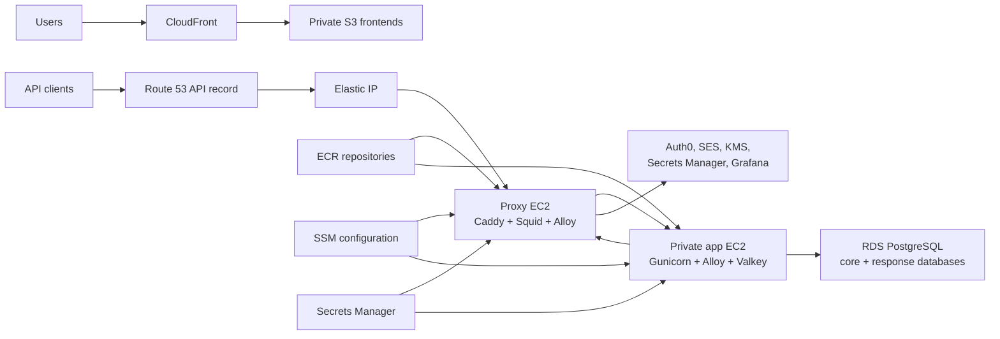

# AWS CDK staging plan

> Planning proposal, not current architecture or deployment truth. It records
> the intended staging shape and decisions still required before implementation.
> The checked-in implementation and the canonical documents remain authoritative
> for current behaviour.

The staging target should preserve the same major boundaries proven by the
Proxmox rehearsal:

- Public proxy host
- Private application host
- Two logical PostgreSQL databases
- Controlled outbound access
- File-backed secrets
- Shared bootstrap and Compose runtime
- Central logs and traces

The AWS version replaces rehearsal fixtures with native services and removes
workstation-owned convergence.

This remains the intended low-cost shape: no ALB, no NAT Gateway, no RDS Proxy,
and initially one proxy and one application instance.

## Phase 1: Resolve the staging contracts

Make the few remaining architectural decisions explicit before adding resources:

- Use one staging RDS PostgreSQL instance containing:
  - `flowform_core`
  - `flowform_response`
  - separate application users and grants for each database
  - a separate migration/administration credential
- Use `api.staging.flow-form.com.au` for the API.
- Keep the public frontends at:
  - `staging.flow-form.com.au`
  - `studio.staging.flow-form.com.au`
- Treat staging as disposable infrastructure but retain automated backups long
  enough to test restore procedures.
- Keep the `nonprod` security scope for KMS and shared non-production secrets.
- Separate environment runtime parameters from security scope:
  - Secrets: `flowform/nonprod/...`
  - Staging runtime configuration: `/flowform/staging/...`
- Decide the private-host deployment control path:
  - Prefer SSM Run Command if connectivity through Squid is proven.
  - Otherwise use the EC2 Instance Connect Endpoint or add narrowly scoped SSM
    interface endpoints.
- Record the single-instance staging availability limitation. Staging will have
  intentional single points of failure.

The environment/scope separation is important. Database addresses, image
digests, CORS origins, and API domains belong to staging even though some
secrets are shared with local non-production.

## Phase 2: Complete the foundational stacks

### SecurityStack

Extend `infra/deployment/aws/cdk/flowform_infra/stacks/security_stack.py` to
finish:

- App, database, linkage, and observability secrets
- KMS encryption
- Least-privilege application and proxy instance roles
- Separate migration/deployment role
- GitHub OIDC deployment permissions
- Exact ECR repository grants instead of repository-name wildcards
- Scoped SSM access:
  - application reads staging backend configuration
  - proxy reads staging proxy configuration
  - deployment role updates image/release parameters
- Route 53 permissions limited to the required hosted zone
- SES send permissions limited to the application role

CDK should create secret containers and generated database credentials, but live
Auth0 and Grafana values should be populated through a controlled operator
process—not CloudFormation parameters or source code.

### RegistryStack

Introduce a dedicated registry/artifact stack rather than coupling repositories
to instance creation.

Create immutable ECR repositories for:

- Backend
- Custom Caddy image
- Squid image
- Alloy mirror, particularly for the private app host

Enable:

- Image scanning
- Encryption
- Lifecycle cleanup for unreferenced staging images
- Deployment by digest rather than mutable tags
- GitHub deployment-role push access
- EC2 pull-only access

Separating this stack avoids a dependency cycle: images must exist before newly
created hosts attempt bootstrap.

## Phase 3: Finish the network and data layer

### NetworkStack

Build on `infra/deployment/aws/cdk/flowform_infra/stacks/network_stack.py`:

- Public proxy subnets
- Isolated application subnets
- Isolated RDS subnets across two availability zones
- No NAT Gateway
- Proxy security group:
  - public `80/443`
  - Squid `3128` only from the app security group
  - backend `5000` outbound only to the app security group
- App security group:
  - backend `5000` only from the proxy
  - PostgreSQL `5432` only to RDS
  - controlled egress through Squid
  - required private endpoint paths
- RDS security group:
  - PostgreSQL only from the application security group
- EC2 Instance Connect Endpoint and its narrowly scoped security group
- S3 gateway endpoint for ECR image layers
- VPC flow logs with staging retention
- Stable private addressing or internal DNS for proxy-to-app communication

The public internet must not be able to reach the app instance or RDS directly.

### DatabaseStack

Replace the placeholder
`infra/deployment/aws/cdk/flowform_infra/stacks/database_stack.py` with:

- PostgreSQL 17 where supported and compatible
- One single-AZ staging RDS instance
- One instance containing the two logical FlowForm databases
- Encrypted storage using the FlowForm KMS key
- Secrets Manager-generated administrative credential
- Separate core and response application users
- Enforced TLS connections
- `pgcrypto` provisioning
- Automated backups and a defined staging retention period
- Performance Insights/Enhanced Monitoring if the cost is acceptable
- CloudWatch exports for PostgreSQL and upgrade logs
- Parameter group enforcing SCRAM authentication and sensible connection/logging
  defaults

CDK should create the server and credentials. Schema creation and upgrades
should remain an explicit migration step, not a CloudFormation custom resource.

## Phase 4: Make compute self-converging

Complete `infra/deployment/aws/cdk/flowform_infra/stacks/application_stack.py`.

### Machine images

Continue using the Packer-built Amazon Linux 2023 AMI through the existing SSM
AMI parameter.

The AMI should contain:

- Docker and Compose
- AWS CLI and required bootstrap utilities
- FlowForm bootstrap scripts
- Runtime Compose definitions
- Systemd bootstrap/recovery units
- Host firewall and hardening configuration

Do not clone the Git repository onto instances at runtime.

### Proxy EC2

Provision:

- One public EC2 instance
- Elastic IP
- Caddy, Squid, and Alloy Compose services
- Route 53 DNS-01 certificate permissions
- API DNS record pointing to the Elastic IP
- User data supplying only host identity, environment, region, and bootstrap
  arguments
- A systemd unit that invokes the shared proxy bootstrap after every boot

### Application EC2

Provision:

- One isolated private EC2 instance
- Backend, Alloy, and optionally local Valkey Compose services
- No public IP
- IMDSv2 required
- File-backed secrets materialized into tmpfs
- Environment configuration rendered from staging SSM parameters
- Docker daemon and application egress configured through Squid
- A systemd unit that invokes the shared application bootstrap after every boot
- Health-based bootstrap completion

For staging, a local Valkey container is the most economical way to make rate
limits authoritative across multiple Gunicorn workers on this single app host.
Bind it only to the private Docker network and do not publish its port. If the
application later gains multiple EC2 instances or rate-limit state must survive
host replacement, move it to ElastiCache.

The backend should trust forwarded client IP information only from the proxy
host. Caddy must overwrite caller-supplied forwarding headers, and the app
security group must ensure Caddy is the only network source for backend requests.

## Phase 5: Complete runtime configuration

Extend `infra/deployment/config/runtime-parameter-contract.json` for staging:

- Backend and supporting image digests
- API and site URLs
- Explicit staging CORS origins
- Auth0 public and management configuration
- RDS endpoints, database names and usernames
- RDS TLS mode
- KMS and linkage-secret ARNs
- SES sender configuration
- Rate-limit backend and trusted-proxy configuration
- Logging and tracing configuration
- Grafana endpoints and tenant identifiers

Keep only non-secret configuration in SSM. Continue materializing secret values
into root-owned tmpfs files through `infra/deployment/bootstrap/bootstrap-app.sh`
and `infra/deployment/bootstrap/bootstrap-proxy.sh`.

No LocalStack endpoints, static AWS credentials, fake DNS, registry rewrites, or
TLS-shim configuration should appear in staging.

## Phase 6: Frontend and public DNS integration

The certificate and frontend stacks are largely present. Finish their integration
with the API:

- Private S3 origins for both frontends
- CloudFront distributions
- ACM certificate in `us-east-1`
- Route 53 aliases
- API base URL set to `https://api.staging.flow-form.com.au`
- Backend CORS allowlist containing the two staging frontend origins
- Matching Auth0 callback, logout, and web-origin configuration
- Appropriate CloudFront security headers and cache policies
- Optional access logging with a defined retention period

CORS, Auth0 URLs, frontend build configuration, API DNS, and Caddy’s configured
hostname must be deployed together.

## Phase 7: Observability and recovery

Complete
`infra/deployment/aws/cdk/flowform_infra/stacks/observability_stack.py`.

Preserve the Proxmox-style Alloy/Grafana pipeline for application logs and
traces, while adding AWS-native infrastructure signals:

- EC2 status-check alarms
- CPU, disk, and memory alerts where agents provide the metrics
- RDS CPU, storage, connections, latency, and failed-authentication signals
- Application readiness and public HTTPS synthetic checks
- CloudFormation deployment failure notifications
- VPC flow logs
- Dashboard covering proxy, app, database, and frontend health
- Alert routing to a controlled staging destination

Verify that the Grafana token stays file-backed and does not enter SSM,
ordinary environment files, user data, logs, or CloudFormation outputs.

## Phase 8: Staging deployment pipeline

Expand the current frontend-only deployment workflow into an ordered release:

1. Run CI against the exact commit.
2. Build and publish the AMI when infrastructure/runtime assets changed.
3. Build backend, Caddy, Squid, and Alloy images.
4. Push immutable images to ECR.
5. Deploy foundation CDK stacks.
6. Populate required staging secrets through the controlled secret-seeding
   process.
7. Publish staging runtime parameters and image digests.
8. Create or update the EC2 hosts.
9. Run the database migration container against both databases.
10. Invoke the idempotent app bootstrap.
11. Verify private readiness and public API health.
12. Build and publish both frontends from the same commit.
13. Run staging smoke and E2E tests.
14. Mark the release successful only after all health gates pass.

A fresh replacement host should self-converge from AMI, instance role, SSM,
Secrets Manager, ECR, and RDS without workstation intervention. The pipeline is
responsible for releases and migrations; it should not be required merely to
recover a rebooted host.

## Staging acceptance gate

Staging is “up” only when all of these pass:

- CDK synth, tests, diff review, and deployment succeed.
- Both EC2 instances converge automatically after reboot.
- Replacing the app instance produces a healthy application without manual SSH.
- API HTTPS and DNS work through Caddy.
- The app and RDS remain unreachable directly from the internet.
- Core and response database users cannot access each other’s database.
- RDS requires TLS and `pgcrypto` works.
- Auth0 login completes through the staging frontend.
- CORS accepts only staging frontend origins.
- The removed test-email route returns `404`.
- SES sends through a legitimate application workflow.
- Rate limits apply consistently across Gunicorn workers.
- Spoofed forwarding headers do not bypass rate limits.
- Public survey creation, completion, encryption, and result retrieval pass end
  to end.
- Logs and traces arrive in Grafana without secrets.
- CloudWatch alarms can be deliberately triggered and observed.
- An RDS snapshot restore has been rehearsed.
- A known-good backend image can be rolled back by digest.

At that point, staging would closely resemble the Proxmox rehearsal in
responsibilities, while using real AWS identity, networking, storage, DNS,
certificates, secrets, and image distribution. It would also provide a credible
rehearsal for the later production CDK configuration without claiming
production-grade availability from the single-host staging topology.

## Related documents

- [[70-planning/active/README|Active plans]]
- [[deployment-model|Deployment model]]
- [[infrastructure|Infrastructure implementation]]
- [[proxmox-rehearsal|Proxmox rehearsal implementation]]
- [[configuration|Configuration implementation]]
- [[continuous-integration|Continuous integration]]
