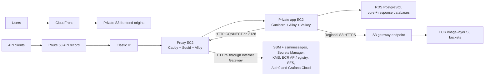

# AWS CDK staging plan

> Planning proposal, not current architecture or deployment truth. It records
> the work required to implement the accepted
> [[0001-aws-staging-infrastructure-target|AWS staging infrastructure target]].
> The checked-in implementation and canonical documents remain authoritative
> for current behaviour.

The staging target should preserve the same major boundaries proven by the
Proxmox rehearsal:

- Public proxy host
- Private application host
- Two logical PostgreSQL databases
- Controlled outbound access
- File-backed secrets
- Shared bootstrap and Compose runtime
- Central logs and traces

The AWS version replaces rehearsal fixtures with native services and removes
workstation-owned convergence.

## Purpose and scope

This plan targets the first empty-data AWS staging environment. It covers the
CDK resources, host bootstrap, runtime configuration, release ordering, and
acceptance evidence required to exercise FlowForm end to end in AWS.

It does not claim production availability, define a production data cutover, or
make the active plan authoritative over the implementation. Production
retention, multi-AZ/high-availability upgrades, and migration of retained data
remain later work.

The immediate work is the
[current registry execution slice](#current-execution-slice-activate-the-registry-path).
Later phases remain in this document for sequencing context, but they are not
part of the present implementation scope.

## Current implementation baseline

The last committed checkout was inspected at commit `40476a8ea79d`. At that
committed baseline:

- `SecurityStack` creates the non-production KMS key, Secrets Manager
  resources, scoped application role, GitHub OIDC roles, and shared SSM
  parameters. Route 53 and the SES identity are imported.
- `NetworkStack` creates the public proxy, isolated application, and isolated
  RDS subnet groups; restrictive security groups; one S3 gateway endpoint; and
  one EC2 Instance Connect Endpoint. It creates no paid interface endpoints and
  no NAT Gateway.
- `ApplicationStack` creates the proxy and application EC2 instances plus the
  proxy Elastic IP, but does not attach user data/bootstrap, create ECR
  repositories, or create the public API record.
- `app.py` already passes construct references between stacks and declares the
  main dependency order. `NetworkStack`, `SecurityStack`, `ApplicationStack`,
  and `FrontendStack` expose concrete resources through public attributes; a
  separate cross-stack contract framework does not yet exist and is not
  automatically required.
- The application and proxy roles already have ECR pull policies, but both use
  repository-name wildcards marked for replacement when the repositories
  exist. The GitHub OIDC trust is repository-scoped but currently accepts every
  subject under that repository.
- `DatabaseStack` and `ObservabilityStack` remain placeholders.
- The frontend certificate and hosting stacks create the private S3,
  CloudFront, ACM, Route 53, and frontend build-parameter resources.
- The shared app and proxy bootstrap scripts already render configuration,
  materialise file-backed secrets, configure application/Docker proxy egress,
  start Compose, and wait for container health. CDK does not yet invoke them.
- The deployment workflow publishes the two frontends only. It does not deploy
  CDK, publish backend images, migrate RDS, or roll the backend.

This section records the committed review baseline, not the current working-tree
delta or a live-deployment attestation. Phase 2 and the current execution slice
identify the registry work added after that baseline.

## Governing decision

[[0001-aws-staging-infrastructure-target|AWS staging infrastructure target]]
owns the accepted structure, required boundaries, explicit exclusions,
consequences, and change control. This plan does not redefine those decisions;
it sequences the work needed to implement and prove them.

## Proxmox-to-AWS translation

| Proxmox rehearsal responsibility | AWS staging replacement |
| --- | --- |
| Terraform VM topology | CDK and CloudFormation |
| Golden AL2023 template | Packer-built encrypted EC2 AMI referenced through SSM |
| LocalStack fixture | Real regional AWS public service endpoints reached through Squid |
| Rehearsal registry | Private ECR repositories |
| TLS shim and rehearsal CA | Public Route 53 DNS plus Caddy DNS-01 TLS for the API; ACM for CloudFront |
| Ephemeral PostgreSQL fixture VM | Private encrypted RDS PostgreSQL |
| Workstation-owned first convergence | EC2 user data plus idempotent systemd bootstrap |
| Rehearsal endpoint/static-credential overrides | EC2 instance roles and normal AWS SDK endpoints |



This remains the intended low-cost shape: no ALB, no NAT Gateway, no RDS Proxy,
no paid VPC interface endpoints, and initially one proxy and one application
instance.

## Current execution slice: activate the registry path

The next work is deliberately narrower than a complete staging deployment. Its
goal is to turn the implemented registry definitions into a usable,
reproducible image-publication path. It ends before NetworkStack, DatabaseStack,
EC2 bootstrap, database migrations, or public traffic are changed.

### Already implemented locally

- `RegistryStack` defines the Backend, Caddy, Squid, and Alloy repositories.
- The repositories use immutable tags, scan-on-push, KMS encryption, and
  environment-specific lifecycle/removal behaviour.
- The staging image-publisher role trusts only the staging branch.
- Publisher and EC2 runtime policies are scoped to the exact repositories,
  except for the account-wide ECR authorization action required by AWS.
- CDK assertions cover the repository controls, publisher access, runtime pull
  boundaries, and shared non-production Security template.

These changes are not evidence that the repositories or role exist in AWS.

### Step 1: Review and activate Security and Registry

1. Review and land the current CDK and documentation changes.
2. Confirm the target AWS account and `ap-southeast-2` region.
3. Confirm that the account is CDK-bootstrapped in `ap-southeast-2` and record
   the actual bootstrap qualifier and deployment role ARNs. Do not infer those
   names when the later infrastructure-deployment policy is written.
4. Synthesize and review the staging diff for
   `FlowForm-Nonprod-Security` and `FlowForm-Staging-Registry`.
5. Use the existing operator deployment principal for the first deployment of
   those two stacks. The GitHub role cannot create itself.
6. Verify in AWS that all four repositories have the declared controls and that
   the image-publisher trust policy accepts only the intended staging identity.

This step does not deploy Network, Database, Application, Frontend, or
Observability stacks. Bootstrapping `us-east-1` is not part of this slice
because it does not deploy the CloudFront certificate stack.

### Step 2: Make all four image inputs reproducible

Before writing the workflow, close the image-source gaps:

- Backend: use `infra/containers/images/backend/backend.Dockerfile`.
- Caddy: add a tracked build definition for the custom Caddy binary and its
  Route 53 module; a Caddy runtime configuration file is not an image build
  definition.
- Squid: replace the current `ubuntu/squid:latest` assumption with an approved,
  pinned upstream digest to mirror.
- Alloy: mirror the approved version by upstream digest, not by a floating tag.
- Select the target platform from the EC2 AMI/instance architecture and use the
  same platform consistently for all four images.

The upstream source, version, digest, target repository, and resulting ECR
digest must be visible in a machine-readable release manifest. Mirroring must
not silently advance when an upstream tag changes.

### Step 3: Add a dedicated image-publication workflow

Add a separate workflow rather than expanding the existing frontend
`deploy.yml` into a full infrastructure release now. The first version should
support manual dispatch and may add automatic publication after successful CI
on `staging` once the manual path is proven.

The workflow must:

1. Check out the exact commit that passed CI.
2. Request only `contents: read` and `id-token: write`.
3. Assume `flowform-staging-image-publisher` through GitHub OIDC.
4. Build Backend and Caddy and mirror the pinned Squid and Alloy inputs.
5. Tag images with an immutable commit/source identity rather than `latest`.
6. Push only to the four staging repositories.
7. Resolve the ECR digest for every pushed manifest.
8. Emit a machine-readable manifest containing complete
   `repository-uri@sha256:<digest>` references.
9. Fail if any image is missing, mutable, for the wrong platform, or resolves to
   a digest different from the pushed manifest.

Extend the publisher policy only with the exact-repository ECR read actions
needed to verify those digests, such as `ecr:DescribeImages`. Do not add SSM,
CloudFormation, EC2, RDS, Secrets Manager, or general AWS read access to make
the workflow convenient.

Image publication is not application deployment. This workflow must not deploy
CDK, write secrets, access RDS, run migrations, update EC2, or change frontend
content.

### Step 4: Define the digest handoff without promoting a release

Add Backend, Caddy, Squid, and Alloy image fields to the tracked runtime
parameter contract, because the current contract does not carry both mirrored
images to both hosts. Keep complete digest references as the values.

For this slice, the publication workflow produces the release manifest as its
output and retains it as a workflow artifact. It does not write the active
staging SSM parameters. Choosing a manifest and promoting those digests is a
later release action with separate authority; publishing an image must not
silently change what staging runs.

The manifest format should be stable enough for the later release workflow to
validate and consume without rebuilding the images.

### Current-slice exit criteria

- The Security and Registry changes are reviewed and tracked in version
  control.
- The account/region and CDK bootstrap identity are confirmed from AWS.
- `FlowForm-Nonprod-Security` and `FlowForm-Staging-Registry` deploy through the
  existing operator path with a reviewed diff.
- AWS inspection confirms four empty-or-populated hardened repositories and the
  branch-restricted publisher role.
- A manually dispatched workflow publishes all four images through OIDC without
  stored AWS access keys.
- The workflow cannot publish outside the four staging repositories.
- One manifest records four complete ECR digest references and matches
  `ecr:DescribeImages` results.
- The runtime parameter contract has explicit fields for all image consumers.
- No infrastructure-deployment role, runtime SSM promotion, EC2 rollout,
  database action, or frontend deployment is bundled into the image workflow.

After these criteria pass, the next active slice is Phase 3: finish and prove
the network boundary, then implement RDS. Live pulls using the EC2 runtime roles
and the Squid/S3 paths remain Phase 4 evidence because those hosts do not yet
exist as an operational deployment.

## Phase 1: Accept the staging target

**Decision status: complete. Implementation status: not started by this
phase.**

[[0001-aws-staging-infrastructure-target|ADR 0001]] now fixes the staging
topology, service exclusions, database layout, domains, environment/security
scope boundary, management path, and accepted availability trade-offs. Phase 1
therefore requires no further architecture selection before CDK work begins.

Typed CDK interfaces, runtime parameters, IAM grants, and deployed resources are
not considered complete merely because the decision is accepted. They are
created incrementally in the phases that own their consumers.

## Phase 2: Add the registry and tighten the existing contracts

**Implementation status: source implementation complete; AWS activation and
image publication open.** The current working tree adds the four KMS-encrypted
repositories, the branch-restricted image-publisher role, exact publisher
permissions, and host-specific app/proxy pull policies. The current execution
slice above owns their first deployment, the missing image build/mirror
contracts, the publication workflow, and the digest manifest.

The infrastructure-deployment role is intentionally deferred until the actual
CDK bootstrap roles are confirmed. Live EC2 pull proof is deferred until the
proxy and application hosts exist.

Phase 2 is an extension of the current CDK graph, not a new foundation.
`SecurityStack`, `NetworkStack`, `ApplicationStack`, and `FrontendStack`
already exchange CDK constructs directly, and `app.py` already owns their
deployment dependencies. Preserve that model and add only the contracts needed
for registry and release work.

### Preserve the current ownership boundaries

Keep these existing boundaries:

- The scope-level `SecurityStack` owns the shared non-production KMS key,
  application/database/linkage secret containers, the backend application
  role, the account-level GitHub OIDC provider, the frontend deployment role,
  and the CI preview role.
- The environment-level `NetworkStack` owns the VPC, subnet selections,
  security groups, S3 gateway endpoint, and EC2 Instance Connect Endpoint.
- The environment-level `ApplicationStack` owns the proxy role, proxy and app
  EC2 instances, and proxy Elastic IP. It consumes the application role and KMS
  key from `SecurityStack`.
- `FrontendStack` owns the resource-specific policy attached to the stable
  frontend role created by `SecurityStack`. This avoids making the shared
  security template depend on environment resources.

The dev and staging contexts must continue to synthesize an identical
`FlowForm-Nonprod-Security` template. Do not add staging-only repository ARNs,
instance IDs, or database resources directly to that shared template.

Continue passing constructs directly in `app.py`. Public stack attributes are
adequate where the contract is small and clear; introduce a typed properties
object or interface only when it reduces a real repeated parameter set. Do not
add a second discovery mechanism merely to describe resources CDK already
knows. SSM remains the runtime configuration/discovery boundary, not the
cross-stack wiring mechanism.

### Add an environment-level RegistryStack

Create `RegistryStack` only for full deployments and place it before
`ApplicationStack` in the dependency graph. It owns four private repositories:

- Backend
- Custom Caddy image
- Squid mirror
- Alloy mirror

The Squid and Alloy repositories intentionally mirror the upstream images
currently referenced by the runtime Compose files. This gives both hosts a
single controlled ECR source and removes a runtime dependency on public image
registries.

Configure each repository with:

- Immutable tags
- Scan-on-push
- Explicit at-rest encryption
- Staging removal behaviour consistent with `EnvConfig.removal_policy`
- Lifecycle rules that expire untagged uploads and bound old releases while
  preserving the current deployment and an intentional rollback window

Lifecycle rules cannot infer whether an image digest is still deployed. The
release process must record the active and rollback digests and choose retention
rules that cannot delete them prematurely.

`RegistryStack` exposes the four `ecr.IRepository` constructs. Runtime
parameters later carry complete immutable references in
`repository-uri@sha256:<digest>` form; mutable environment tags are not
deployment inputs.

### Replace the current ECR wildcards in this phase

Both runtime roles already exist, so exact pull permissions need not wait for a
later compute phase:

- The app role pulls Backend and Alloy.
- The proxy role pulls Caddy, Squid, and Alloy.
- `ecr:GetAuthorizationToken` remains account-wide because the ECR API does not
  support resource scoping for that action.
- Layer and manifest actions are restricted to the exact repositories.

Follow the pattern already used by `FrontendStack`: keep stable roles and trust
in `SecurityStack`, but create policies that reference environment resources in
the resource-owning or consuming environment stack and attach them to those
roles. Remove the repository-name wildcard policies from
`SecurityStack._grant_backend_runtime_reads()` and
`ApplicationStack._grant_ecr_pull()`.

### Separate image publication from infrastructure deployment

Reuse the existing account-level GitHub OIDC provider. The scope-level Security
stack now owns the stable image-publisher role, and `RegistryStack` attaches its
exact repository permissions.

Do not add the infrastructure-deployment role in the current slice. First
inspect the account's real CDK bootstrap qualifier and role ARNs. A later
infrastructure role can then be limited to assuming those confirmed bootstrap
roles for the declared FlowForm stacks instead of relying on guessed names or a
broad administrator policy.

The first deployment of the image-publisher role and repositories remains an
operator action using the existing privileged deployment principal. A role
cannot be relied upon to create itself.

Tighten trust by role rather than reusing the current
`repo:Shayman-M-86/FlowForm:*` subject for every purpose:

- The publishing role accepts only the intended staging branch workflow
  identity.
- The later deployment role will receive its own branch/environment trust when
  its bootstrap-role contract is implemented.
- The existing preview role may retain the broader internal pull-request shape
  needed for read-only CDK diff, but must not gain deployment permissions.
- The existing frontend deployment role is tightened to the same staging
  deployment boundary.

Do not give GitHub direct RDS network access or database-secret reads. The later
migration/release identity should be distinct from infrastructure deployment
and should invoke an approved SSM document or command on the private app host.
The migration container then uses the app host's runtime identity and
file-backed database credentials. Add that command permission only when the
database, instance target, and SSM document exist.

### Extend security with the consuming phase

The current security work is partly implemented, so later phases should refine
it rather than recreate it:

| Owning work | Existing state to preserve | Change when the consumer exists |
| --- | --- | --- |
| Registry | OIDC provider, image-publisher role, four repositories, and exact publisher/app/proxy policies exist in source | Activate them in AWS, add only exact digest-verification reads, and implement the publication workflow |
| Database | KMS key and grouped app-user password secret already exist | Add the RDS administrative credential, KMS/resource grants, migration command boundary, and exact database outputs |
| Application | App role already has exact secret reads, KMS encrypt/decrypt, SES send, and scoped SSM reads; proxy role has hosted-zone-scoped Route 53 permissions | Add SSM Agent/command permissions, exact runtime parameter access, and resource-scoped release controls as bootstrap is wired |
| Frontend | Frontend role and resource-attached deployment policy exist | Tighten OIDC subject conditions and retain exact S3, CloudFront, and SSM grants |
| Observability | Runtime Alloy configuration exists but the CDK stack is empty | Add only the secret, metric, log, alarm, and notification permissions selected in Phase 7 |

Every permission change must have a real consumer and a synth assertion. Avoid
moving all IAM policy construction into `SecurityStack`; doing so would either
reintroduce environment-specific values into the shared security template or
force manual ARN construction.

### Resulting stack graph

```text
Security ──────> Registry ───────────────┐
    │                                    │
    ├──────────> Database <── Network    ├──> Application ──> Observability
    │                │          │        │
    │                └──────────┴────────┘
    │
    └──────────> Frontend <── FrontendCert
```

Arrows show prerequisite-to-consumer order. `ApplicationStack` consumes the
registry repositories, the existing network resources, the existing application
role and KMS key, and—after Phase 3—the database outputs.

### Phase 2 exit criteria

- Staging synthesis includes one environment-level `RegistryStack` with the
  four repositories.
- Repository immutability, scanning, encryption, removal behaviour, and
  lifecycle rules have synth assertions.
- The non-production Security template remains byte-identical when synthesized
  from dev and staging contexts.
- Exact repository policies replace the current app-role and proxy-role ECR
  wildcards.
- The image publisher can push only to the four staging repositories.
- The image publisher has branch-restricted OIDC trust; the preview role remains
  read-only and does not gain publication permissions.
- The CDK graph synthesizes without cycles and without manually reconstructed
  repository ARNs.
- The dedicated publication workflow records complete Backend, Caddy, Squid,
  and Alloy digest references without promoting them to active staging state.

## Phase 3: Finish the network and data layer

### NetworkStack

The current `NetworkStack` already creates the two-AZ public proxy, isolated
application, and isolated RDS subnet groups; restrictive proxy/app/RDS/EICE
security groups; no NAT Gateway; the S3 gateway endpoint and regional ECR-layer
bucket policy; DNS/NTP egress; and the EC2 Instance Connect Endpoint.

Preserve those tested controls. Phase 3 network work is limited to closing and
proving the remaining gaps:

- Add VPC flow logs with a defined staging destination and retention.
- Choose and implement stable proxy-to-app and app-to-proxy addressing, using
  private DNS or controlled private addresses rather than deployment-time
  guesswork.
- Verify that the endpoint route-table associations and endpoint policy cover
  real ECR layer downloads without granting general staging bucket access.
- Add or refine synth assertions for the complete ingress/egress matrix,
  endpoint policy, lack of NAT and paid interface endpoints, and management
  path.
- Prove the design in a deployed VPC before treating the repository definition
  as an operational boundary.

The public internet must not be able to reach the app instance or RDS directly.

#### Endpoint and egress boundary

The S3 gateway endpoint and EC2 Instance Connect Endpoint are the only endpoints
planned for initial staging. Do not create interface endpoints for SSM,
`ssmmessages`, Secrets Manager, KMS, ECR, CloudWatch, or SES.

The private app host reaches those services using the normal regional public
hostnames through Squid:

```text
private app EC2
  -> proxy security group on TCP 3128
  -> Squid HTTP CONNECT tunnel
  -> proxy public route and Internet Gateway
  -> approved HTTPS service hostname
```

Squid must allow only the required regional AWS and external destinations. At a
minimum, review the allowlist for:

- `ssm` and `ssmmessages`
- Secrets Manager and KMS
- ECR API and registry
- SES
- Auth0
- Grafana Cloud

Use a current SSM Agent that prefers `ssmmessages`; retain `ec2messages` only if
an intentionally supported older-agent fallback proves it is required.

ECR pulls split across two paths. ECR authentication, manifest, and registry
requests use Squid. The returned regional S3 layer URLs must bypass Squid so the
app subnet's S3 gateway endpoint route is used. Associate the gateway endpoint
with the app subnet route tables, allow TCP `443` to the regional S3 prefix
list, and include `.s3.<region>.amazonaws.com` in the Docker daemon's
`NO_PROXY`.

### DatabaseStack

Replace the placeholder
`infra/deployment/aws/cdk/flowform_infra/stacks/database_stack.py` with:

- PostgreSQL 17 where supported and compatible
- One single-AZ staging RDS instance
- One instance containing the two logical FlowForm databases
- Encrypted storage using the FlowForm KMS key
- Secrets Manager-generated administrative credential
- Separate core and response application users
- Enforced TLS connections
- `pgcrypto` provisioning
- Automated backups and a defined staging retention period
- Performance Insights/Enhanced Monitoring if the cost is acceptable
- CloudWatch exports for PostgreSQL and upgrade logs
- Parameter group enforcing SCRAM authentication and sensible connection/logging
  defaults

CDK should create the server and credentials. Schema creation and upgrades
should remain an explicit migration step, not a CloudFormation custom resource.

## Phase 4: Make compute self-converging

Complete `infra/deployment/aws/cdk/flowform_infra/stacks/application_stack.py`.

### Machine images

Continue using the Packer-built Amazon Linux 2023 AMI through the existing SSM
AMI parameter.

The AMI should contain:

- Docker and Compose
- AWS CLI and required bootstrap utilities
- FlowForm bootstrap scripts
- Runtime Compose definitions
- Systemd bootstrap/recovery units
- Host firewall and hardening configuration

Do not clone the Git repository onto instances at runtime.

### Proxy EC2

Provision:

- One public EC2 instance
- Elastic IP
- Caddy, Squid, and Alloy Compose services
- Route 53 DNS-01 certificate permissions
- API DNS record pointing to the Elastic IP
- User data supplying only host identity, environment, region, and bootstrap
  arguments
- A systemd unit that invokes the shared proxy bootstrap after every boot
- A stable private address or internal name known before application bootstrap
- A CloudFormation readiness signal only after Squid and the proxy Compose
  services are healthy

### Application EC2

Provision:

- One isolated private EC2 instance
- Backend, Alloy, and local Valkey Compose services
- No public IP
- IMDSv2 required
- File-backed secrets materialized into tmpfs
- Environment configuration rendered from staging SSM parameters
- Docker daemon and application egress configured through Squid
- SSM Agent configured through its own systemd proxy drop-in
- A systemd unit that invokes the shared application bootstrap after every boot
- Health-based bootstrap completion

Proxy settings are consumer-specific. Configure all of the following rather
than assuming a shell environment configures the entire host:

- Host AWS CLI and bootstrap commands
- Docker daemon
- Backend and migration containers
- SSM Agent
- Any other host agent that needs public AWS or external endpoints

For the HTTP Squid proxy, both `HTTP_PROXY` and `HTTPS_PROXY` use an
`http://<proxy>:3128` URI. Squid tunnels HTTPS with `CONNECT`; it does not
decrypt the TLS session. Set both upper- and lower-case variables where the
consumer requires them. `NO_PROXY` must include IMDS
(`169.254.169.254`), localhost, direct RDS names, and the regional S3 hostname
suffix. IMDS must never traverse Squid because the app host and containers need
credentials from the app instance role, not the proxy role.

For staging, a local Valkey container is the most economical way to make rate
limits authoritative across multiple Gunicorn workers on this single app host.
Bind it only to the private Docker network and do not publish its port. If the
application later gains multiple EC2 instances or rate-limit state must survive
host replacement, move it to ElastiCache.

The backend should trust forwarded client IP information only from the proxy
host. Caddy must overwrite caller-supplied forwarding headers, and the app
security group must ensure Caddy is the only network source for backend requests.

#### First-boot ordering

The proxy must be operational before the private app can use SSM, retrieve
configuration or secrets, authenticate to ECR, or pull images. A CloudFormation
dependency proves resource creation order, not Squid health. Use this order:

1. Start the proxy instance and run `bootstrap-proxy.sh`.
2. Signal proxy readiness only after Squid and the proxy Compose stack are
   healthy.
3. Start or unblock the application bootstrap.
4. Write the SSM Agent proxy drop-in and restart the agent.
5. Fetch staging parameters and non-production secrets with retry/backoff.
6. Configure Docker's proxy and direct S3 bypass.
7. Pull images, start the app Compose stack, and wait for readiness.

The systemd bootstrap must keep bounded retry/backoff behaviour so a temporary
proxy or AWS API outage does not require workstation intervention.

## Phase 5: Complete runtime configuration

Extend `infra/deployment/config/runtime-parameter-contract.json` for staging:

- Backend and supporting image digests
- API and site URLs
- Explicit staging CORS origins
- Auth0 public and management configuration
- RDS endpoints, database names and usernames
- RDS TLS mode
- KMS and linkage-secret ARNs
- SES sender configuration
- Rate-limit backend and trusted-proxy configuration
- Logging and tracing configuration
- Grafana endpoints and tenant identifiers
- Proxy private address/name and the approved Squid destination contract

Keep only non-secret configuration in SSM. Continue materializing secret values
into root-owned tmpfs files through `infra/deployment/bootstrap/bootstrap-app.sh`
and `infra/deployment/bootstrap/bootstrap-proxy.sh`.

No LocalStack endpoints, static AWS credentials, fake DNS, registry rewrites, or
TLS-shim configuration should appear in staging.

Runtime settings belong under `/flowform/staging/...`; security resources and
secret names remain under the shared `nonprod` scope. The bootstrap contract
must therefore carry both `FLOWFORM_ENV=staging` and
`FLOWFORM_SCOPE=nonprod` instead of using one namespace for both purposes.

## Phase 6: Frontend and public DNS integration

The certificate and frontend stacks are largely present. Finish their integration
with the API:

- Private S3 origins for both frontends
- CloudFront distributions
- ACM certificate in `us-east-1`
- Route 53 aliases
- API base URL set to `https://api.staging.flow-form.com.au`
- Backend CORS allowlist containing the two staging frontend origins
- Matching Auth0 callback, logout, and web-origin configuration
- Appropriate CloudFront security headers and cache policies
- Optional access logging with a defined retention period

CORS, Auth0 URLs, frontend build configuration, API DNS, and Caddy’s configured
hostname must be deployed together.

## Phase 7: Observability and recovery

Complete
`infra/deployment/aws/cdk/flowform_infra/stacks/observability_stack.py`.

Preserve the Proxmox-style Alloy/Grafana pipeline for application logs and
traces, while adding AWS-native infrastructure signals:

- EC2 status-check alarms
- CPU, disk, and memory alerts where agents provide the metrics
- RDS CPU, storage, connections, latency, and failed-authentication signals
- Application readiness and public HTTPS synthetic checks
- CloudFormation deployment failure notifications
- VPC flow logs
- Dashboard covering proxy, app, database, and frontend health
- Alert routing to a controlled staging destination

Verify that the Grafana token stays file-backed and does not enter SSM,
ordinary environment files, user data, logs, or CloudFormation outputs.

## Phase 8: Staging deployment pipeline

Expand the current frontend-only deployment workflow into an ordered release:

1. Run CI against the exact commit.
2. Build and publish the AMI when infrastructure/runtime assets changed.
3. Build backend, Caddy, Squid, and Alloy images.
4. Push immutable images to ECR.
5. Deploy foundation CDK stacks.
6. Populate required staging secrets through the controlled secret-seeding
   process.
7. Publish staging runtime parameters and image digests.
8. Create or update the proxy host and wait for its Squid/Compose readiness
   signal.
9. Create or update the application host and prove SSM Agent connectivity
   through Squid.
10. Run the database migration container against both databases.
11. Invoke the idempotent app bootstrap.
12. Verify private readiness and public API health.
13. Build and publish both frontends from the same commit.
14. Run staging smoke and E2E tests.
15. Mark the release successful only after all health gates pass.

A fresh replacement host should self-converge from AMI, instance role, SSM,
Secrets Manager, ECR, and RDS without workstation intervention. The pipeline is
responsible for releases and migrations; it should not be required merely to
recover a rebooted host.

## Staging acceptance gate

Staging is “up” only when all of these pass:

- CDK synth, tests, diff review, and deployment succeed.
- Both EC2 instances converge automatically after reboot.
- Replacing the app instance produces a healthy application without manual SSH.
- API HTTPS and DNS work through Caddy.
- The app and RDS remain unreachable directly from the internet.
- No NAT Gateway or paid VPC interface endpoints exist in the staging VPC.
- SSM Agent, AWS CLI, Secrets Manager, KMS, ECR API/registry, SES, Auth0, and
  Grafana connectivity from the private app path work through Squid.
- ECR image-layer traffic from the app subnet uses the regional S3 gateway
  endpoint rather than Squid.
- Squid denies an unapproved destination and does not decrypt HTTPS.
- IMDS calls bypass Squid and return the app instance role, never the proxy role.
- Core and response database users cannot access each other’s database.
- RDS requires TLS and `pgcrypto` works.
- Auth0 login completes through the staging frontend.
- CORS accepts only staging frontend origins.
- The removed test-email route returns `404`.
- SES sends through a legitimate application workflow.
- Rate limits apply consistently across Gunicorn workers.
- Spoofed forwarding headers do not bypass rate limits.
- Public survey creation, completion, encryption, and result retrieval pass end
  to end.
- Logs and traces arrive in Grafana without secrets.
- CloudWatch alarms can be deliberately triggered and observed.
- An RDS snapshot restore has been rehearsed.
- A known-good backend image can be rolled back by digest.

At that point, staging would closely resemble the Proxmox rehearsal in
responsibilities, while using real AWS identity, networking, storage, DNS,
certificates, secrets, and image distribution. It would also provide a credible
rehearsal for the later production CDK configuration without claiming
production-grade availability from the single-host staging topology.

## Exit criteria

Move this document out of `active/` only after:

- the planned CDK stacks and delivery workflow are implemented;
- the staging acceptance gate has recorded reproducible evidence;
- current-state claims have been moved into the relevant architecture,
  workflow, implementation, and reference documents;
- lasting decisions that warrant ADRs have been recorded separately; and
- unresolved production-only work has been moved to its own active plan.

## External references

- [AWS CLI HTTP proxy configuration](https://docs.aws.amazon.com/cli/latest/userguide/cli-configure-proxy.html)
- [SSM Agent proxy configuration on Linux](https://docs.aws.amazon.com/systems-manager/latest/userguide/configure-proxy-ssm-agent.html)
- [Systems Manager message API behaviour](https://docs.aws.amazon.com/systems-manager/latest/userguide/systems-manager-setting-up-messageAPIs.html)
- [S3 gateway endpoints](https://docs.aws.amazon.com/vpc/latest/privatelink/vpc-endpoints-s3.html)
- [EC2 Instance Connect Endpoint](https://docs.aws.amazon.com/AWSEC2/latest/UserGuide/connect-with-ec2-instance-connect-endpoint.html)

## Related documents

- [[70-planning/active/README|Active plans]]
- [[0001-aws-staging-infrastructure-target|AWS staging infrastructure target]]
- [[deployment-model|Deployment model]]
- [[runtime-containers|Runtime containers]]
- [[trust-boundaries|Trust boundaries]]
- [[infrastructure|Infrastructure implementation]]
- [[proxmox-rehearsal|Proxmox rehearsal implementation]]
- [[configuration|Configuration implementation]]
- [[continuous-integration|Continuous integration]]
- [[cloud-deployment|Cloud deployment]]
- [[secrets-and-configuration|Secrets and configuration]]
