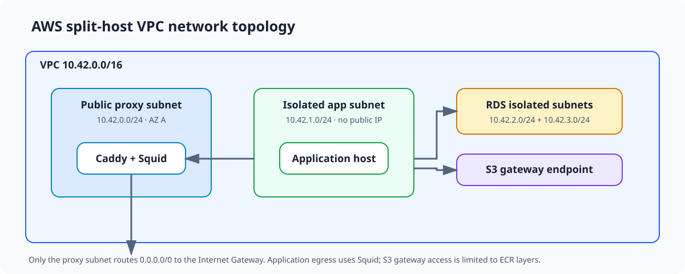

# AWS network topology



FlowForm's full-deployment AWS environments use a split-host VPC: a public
proxy role accepts internet traffic and provides controlled outbound access,
while the application and database roles remain isolated from direct internet
routing. `NetworkStack` owns the VPC, subnets, routes, security groups,
endpoints, private hosted zone, management endpoint, and VPC flow logs.

This page describes the checked-in network contract. It does not certify that a
particular AWS deployment is currently healthy. The staging stack was inspected
after its initial deployment on 2026-07-27 and matched this structure, but
ongoing operational status and drift must be checked in AWS.

## VPC and subnet layout

The VPC uses `10.42.0.0/16` and explicitly creates four subnets rather than
asking the CDK VPC construct to generate a symmetrical subnet set.

| Role | CIDR | Placement | Routing purpose |
| --- | --- | --- | --- |
| Proxy public A | `10.42.0.0/24` | First selected Availability Zone | Public Caddy ingress and Squid egress |
| Application isolated A | `10.42.1.0/24` | First selected Availability Zone | Private backend and application-side services |
| RDS isolated A | `10.42.2.0/24` | First selected Availability Zone | Intended single-AZ database placement |
| RDS isolated B | `10.42.3.0/24` | Second selected Availability Zone | Second member required by the RDS DB subnet group |

Staging resolves those placements to `ap-southeast-2a` and
`ap-southeast-2b`. The second RDS subnet satisfies the subnet-group
Availability Zone requirement; it does not make the database Multi-AZ. The
initial proxy, application, and database resources are intended to run in the
first Availability Zone.

The proxy subnet disables automatic public-IP assignment. `ApplicationStack`
later attaches a deliberate Elastic IP to the proxy instance. The application
instance explicitly has no public IP.

```text
VPC 10.42.0.0/16
|
+-- AZ A
|   +-- proxy public      10.42.0.0/24
|   +-- app isolated      10.42.1.0/24
|   `-- RDS isolated A    10.42.2.0/24
|
`-- AZ B
    `-- RDS isolated B    10.42.3.0/24
```

## Routing and egress

Only the proxy route table has a default route:

```text
proxy subnet  -- 0.0.0.0/0 --> Internet Gateway
app subnet    -- S3 prefix --> S3 gateway endpoint
RDS subnets   -- local VPC routes only
```

The initial topology deliberately has no NAT Gateway and no paid VPC interface
endpoints. The S3 gateway endpoint is associated only with the application
subnet route table. Its policy permits `s3:GetObject` only from the regional
ECR starport layer bucket used to deliver image layers.

ECR pulls therefore cross two paths:

- ECR authorization, manifest, and registry requests use the private
  application's Squid path through the proxy host.
- The resulting regional S3 layer downloads use the application's direct S3
  gateway route.

Other approved AWS and external HTTPS destinations also use Squid:

```text
private application
    |
    | TCP 3128
    v
Squid on proxy
    |
    | HTTPS through the proxy subnet and Internet Gateway
    v
approved public service endpoint
```

The network layer allows the application to reach Squid, but the Squid
configuration owns the hostname allowlist and CONNECT policy. Runtime proxy and
`NO_PROXY` configuration remain host-bootstrap responsibilities.

## Security-group boundaries

Every stack-owned security group disables default unrestricted egress. The
principal paths are:

| Source | Destination | Port | Purpose |
| --- | --- | --- | --- |
| Public IPv4 | Proxy | TCP `80`, `443` | Caddy HTTP/HTTPS ingress |
| Application security group | Proxy | TCP `3128` | Squid forward proxy |
| Application security group | Proxy | TCP `3500`, `4317` | Alloy logs and OTLP traces |
| Proxy security group | Application | TCP `5000` | Caddy to backend |
| Application security group | RDS | TCP `5432` | PostgreSQL |
| EC2 Instance Connect Endpoint security group | Application | TCP `22` | Private-host recovery access |
| Application | Regional S3 prefix list | TCP `443` | ECR image layers through the gateway endpoint |
| Proxy | Public IPv4 | TCP `443` | Approved HTTPS egress |

The proxy and application groups also allow DNS on TCP/UDP `53` to the VPC
resolver path and UDP `123` to Amazon Time Sync. RDS accepts PostgreSQL only
from the application security group. The application accepts backend traffic
only from the proxy and management traffic only from the Instance Connect
Endpoint.

Security groups establish network reachability, not application authority.
Caddy must still normalise forwarding headers, Squid must enforce its
destination policy, the backend must apply authentication and trusted-proxy
rules, and PostgreSQL must enforce its own identities and grants.

## Private discovery and management

`NetworkStack` creates the environment-specific private Route 53 hosted zone.
For staging it is:

```text
internal.staging.flow-form.com.au
```

`ApplicationStack` consumes that zone and creates one-minute A records for the
instance private addresses:

```text
proxy.internal.staging.flow-form.com.au
app.internal.staging.flow-form.com.au
```

The records are application-stack resources because they depend on the EC2
instances. The zone and the stable naming contract remain network-stack
resources.

An EC2 Instance Connect Endpoint is placed in the application subnet with
client-IP preservation disabled. Its security group can reach only the
application security group on TCP `22`. This is a bounded recovery and
management path, not public SSH exposure.

## Flow visibility

The VPC flow log records accepted and rejected traffic for the whole VPC and
sends it to:

```text
/flowform/<environment>/vpc-flow
```

The aggregation interval is ten minutes. Retention comes from the typed
environment configuration; staging currently retains seven days. Flow logs
provide network-flow evidence but do not replace application access logs,
distributed traces, service health checks, or Squid audit logs.

## Ownership boundary

`NetworkStack` does not create:

- Proxy or application EC2 instances.
- The proxy Elastic IP or public API DNS record.
- RDS itself or its logical databases and users.
- Caddy, Squid, Alloy, backend, or Valkey configuration.
- Runtime proxy variables or the Squid destination allowlist.
- Paid service interface endpoints or a NAT Gateway.

Those responsibilities belong to the application, database, container,
bootstrap, or release layers described by [[deployment-model|Deployment
model]]. [[trust-boundaries|Trust boundaries]] explains why the network controls
are only one part of the deployed security boundary, and
[[services-and-ports|Services and ports]] records the corresponding maintained
runtime listeners.

## Related documents

- [[deployment-index|Deployment documentation]]
- [[deployment-model|Deployment model]]
- [[trust-boundaries|Trust boundaries]]
- [[services-and-ports|Services and ports]]
