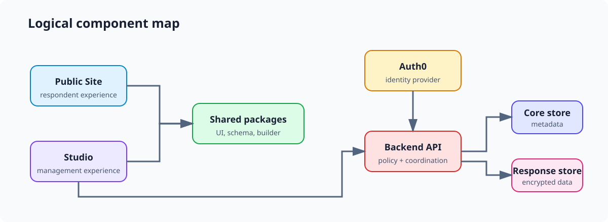

# Component map



This map names durable logical boundaries. It stops short of file-level
ownership, commands, sequence detail, and deployment topology.
Actors and externally operated dependencies belong to [[system-context|System
context]].

| Component | Responsibility |
| --- | --- | --- |
| Public site | Public product and documentation experience. |
| Studio application | Authenticated management and respondent-facing application surface. |
| Shared frontend packages | Reusable builder, schema, UI, styles, and site-shell capabilities. |
| Backend API | HTTP coordination of identity, policy, persistence, encryption, and email. |
| Core and response stores | Separate administrative/content and protected response-data boundaries. |

```text
Public Site --------> shared frontend packages <-------- Studio
                                                           |
                                                           | HTTP API
                                                           v
Auth0 <----------------------------------------------> Backend API
                                                           |
                                                services + policy
                                                  /             \
                                                 v               v
                                           Core store      Response store
```

The core and response stores are separate boundaries. Cross-store submission
work therefore needs explicit ordering and recovery logic, described in
[[data-flows|Data flows]]. The diagram is a logical dependency view, not a
guarantee of mechanically enforced layering or a deployment claim.

## Related documents

- [[reference-index|Reference documentation]]
- [[system-context|System context]]
- [[repository-map|Repository map]]
- [[data-flows|Data flows]]
