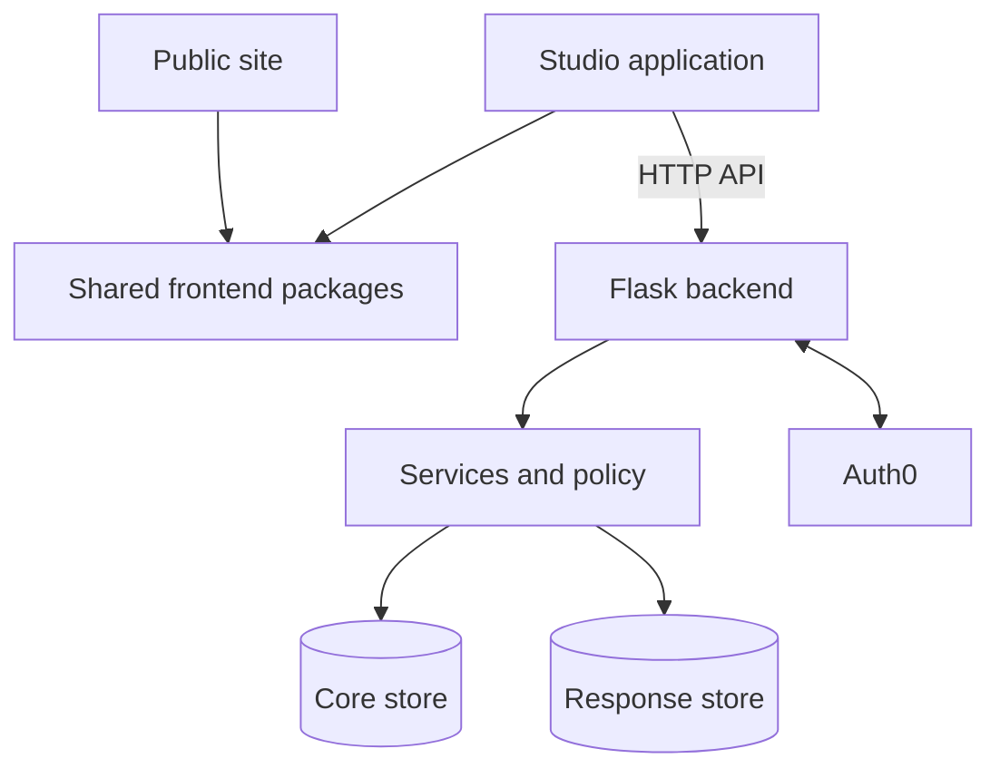

# Component map

This draft maps logical components and their principal dependencies. It stops
short of file-level ownership, sequence detail, and deployment topology.

| Component | Responsibility | Primary dependencies |
| --- | --- | --- |
| Public site | Static public product and documentation experience | shared frontend packages |
| Studio application | Project/survey management and respondent UI surface | Auth0, backend API, shared packages |
| Shared frontend packages | Builder, schema, UI, styles, and site-shell source shared by applications | generated backend contract where applicable |
| Backend API | HTTP boundary and coordination of auth, policy, persistence, encryption, and email | Auth0, service dependencies, core/response stores |
| Core data store | Identifying/admin state, survey content/access, and submission metadata | backend only |
| Response data store | Encrypted envelopes and answer rows, separate from core SQL relations | backend only |

The core and response stores are separate boundaries. Cross-store submission
work therefore needs explicit ordering and recovery logic, described in
[[data-flows|Data flows]]. The diagram is a logical dependency view, not a
guarantee of mechanically enforced layering or a deployment claim.

## Related documents

- [[reference-index|Reference documentation]]
- [[repository-map|Repository map]]
- [[data-flows|Data flows]]
