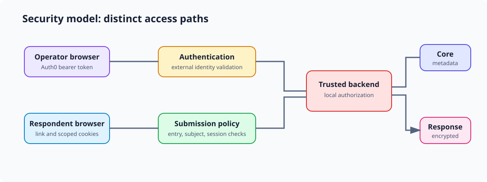

# Security model



FlowForm separates operator access from respondent access, maps authenticated
external identities into local authorization state, hashes respondent session
and recognition credentials, and stores encrypted response values outside the
identity-bearing core store. Repository infrastructure also defines a public
proxy, private application role, constrained runtime containers, and secrets
delivery paths. These are controls visible in source and configuration, not a
claim that a live deployment has every declared control applied.

```text
operator browser -- Auth0 token --> backend authentication
                                         |
                                         v
                                  local authorization
                                         |
respondent browser -- link/cookie ------>+------> submission policy
                                         |
                         +---------------+---------------+
                         |                               |
                    Core store                    Response store
                identity + metadata             encrypted answers
                         \                               /
                          +------ trusted backend ------+
```

## Identity and authorization

Auth0 is the external identity provider for authenticated flows. Backend auth
middleware validates bearer credentials, while local users and access services
apply project and survey authorization. Public and link-based respondent access
uses a separate policy path; possession of an active survey-link credential can
grant the access allowed by its type and state. See [[identity-and-authentication|Identity
and authentication]] for the identity lifecycle and
[[respondent-access-and-continuity|Respondent access and continuity]] for the
product policy.

Respondent session and recognition credentials are represented by hashes in core
data and are returned to browsers as scoped cookies. Browser safety still needs
explicit review: cookie attributes and CORS handling are not a substitute for a
demonstrated CSRF policy, and deployment configuration determines the effective
origin boundary.

## Data, secrets, and runtime

Response values use a KMS-wrapped survey key, wrapped session keys, AES-GCM
payload encryption, and versioned opaque locators. The core and response stores
limit what either database contains alone, but the backend is a trusted
plaintext-handling point. [[responses-and-encryption|Responses and encryption]]
owns the detailed data model.

Configuration and bootstrap assets support file-backed secrets and separate
runtime configuration. Container and deployment definitions describe reduced
container privileges, read-only filesystems with temporary writable areas, a
reverse proxy, and restricted application connectivity. The public Caddy proxy
applies coarse request budgets by direct peer IP before proxying to Flask. The
backend retains a separate in-memory IP limiter, while the email service applies
in-memory recipient cooldown and global-send budgets. Their existence in the
repository does not establish deployed IAM, network, certificate, rate-limit,
backup, monitoring, or incident-response outcomes.

The durable host and container invariants, including privileged integration
points that can undermine otherwise constrained workloads, belong to
[[runtime-infrastructure-security|Runtime infrastructure security]].

## Known limitations to retain during review

Rate-limit state is local to the current Caddy instance or application process;
the checked-in configuration does not enable shared cross-instance counters.
IP-based enforcement also depends on correct client attribution if another CDN
or load balancer is introduced. Cross-store response operations are coordinated
by the application rather than by one transaction. Key material can be resident
in worker memory. The repository does not by itself establish governance for
privileged users, deployment-state verification, comprehensive endpoint
authorization coverage, or a complete threat model.

## Related documents

- [[security-index|Security knowledge]]
- [[trust-boundaries|Trust boundaries]]
- [[identity-and-authentication|Identity and authentication]]
- [[respondent-access-and-continuity|Respondent access and continuity]]
- [[responses-and-encryption|Responses and encryption]]
- [[configuration|Configuration and secrets]]
- [[runtime-infrastructure-security|Runtime infrastructure security]]
